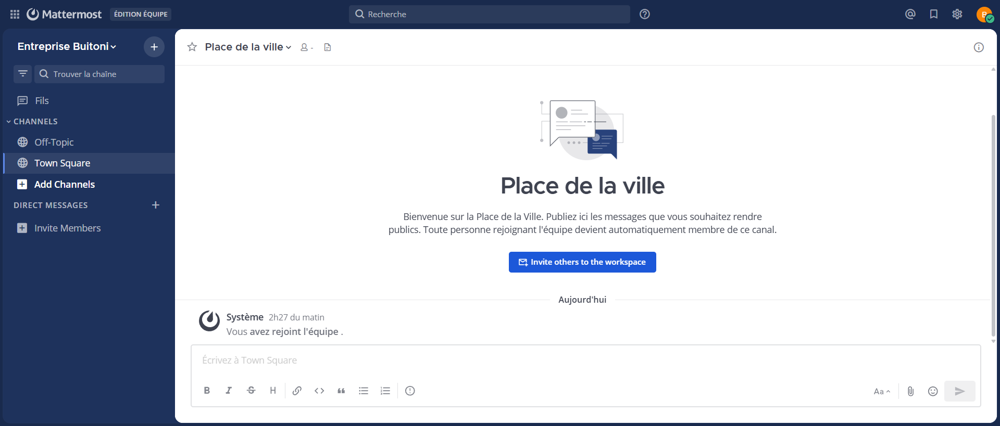
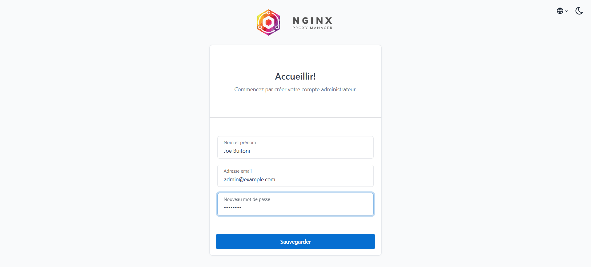

# 🔐 Projet Docker – Mattermost avec Nginx Proxy Manager & CI/CD

Ce projet met en place une plateforme collaborative Mattermost
déployée avec Docker, sécurisée via Nginx Proxy Manager,
et prête pour l’automatisation CI/CD.

---

## 🎯 Objectifs

- Déployer Mattermost avec Docker
- Utiliser PostgreSQL comme base de données
- Mettre en place un reverse proxy
- Simuler un domaine local
- Préparer l’intégration CI/CD
- Documenter le projet

---

## 🧱 Architecture

Navigateur → Nginx Proxy Manager → Mattermost → PostgreSQL

---

## ⚙️ Technologies utilisées

- Docker
- Docker Compose
- Mattermost
- PostgreSQL
- Nginx Proxy Manager
- Git / GitHub
- WSL / Linux

---

## 🚀 Installation

### 1. Cloner le projet

```bash
git clone https://github.com/SergesBuitoni/docker-mattermost-ci.git
cd docker-mattermost-ci
2. Lancer les services
docker compose up -d
3. Accéder aux services

Mattermost : http://mattermost.local

NPM Admin : http://localhost:81

## 📸 Captures d’écran

### Mattermost – Interface utilisateur


### Mattermost – Accès via Reverse Proxy


### Nginx Proxy Manager – Interface Admin


##Compétences développées

Conteneurisation

Déploiement applicatif

Reverse proxy

Réseaux Docker

Automatisation

Documentation technique

👤 Auteur

Joseph Mboui
Junior DevOps / Cloud / Cybersécurité
